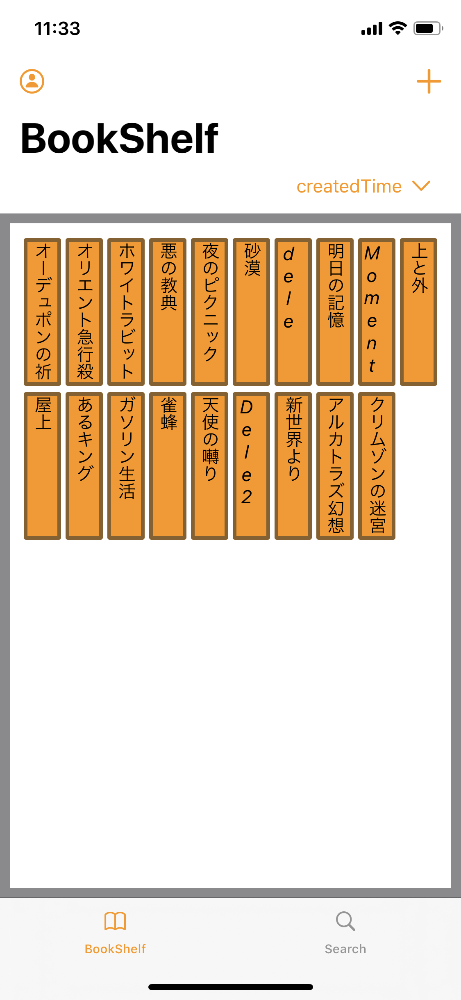
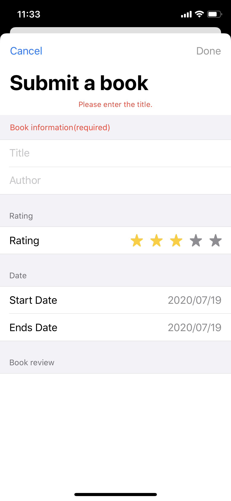
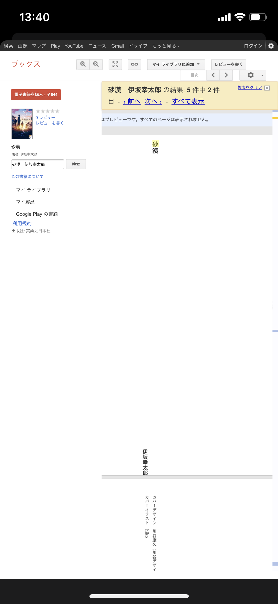

# BookShelf

# 紹介
読んだ本を本棚のように整理することができるアプリです。  
MVVMで作成しましたが、設計を意識した開発は初めてなので、所々設計手法に添えていない箇所があると思います。

# 機能
- 本の登録、編集、削除  
- 本棚の並び替え（本の登録日、著者、タイトル順）  
- Google Books APIを使用した本の検索  

# 技術
- 開発言語 : Swift  
- フレームワーク : SwiftUI  
- 設計 : MVVM + Combine  
- データベース : Firebase  
- ユーザー認証 : 匿名認証、Sign In With Apple  
- パッケージ管理 : Cocoapods  
- バージョン管理 : Git  

# オープンソースライブラリ
- Firebase  
- SwiftyJSON（JSONパーサー）  
- SDWebImageSwiftUI（WebImageの表示）  
- IQKeyboardManagerSwift（keyboardの上げ下げ、dismiss）  
- ExytePopupView（popupの表示）  
- WaterfallGrid（データの並び）  

